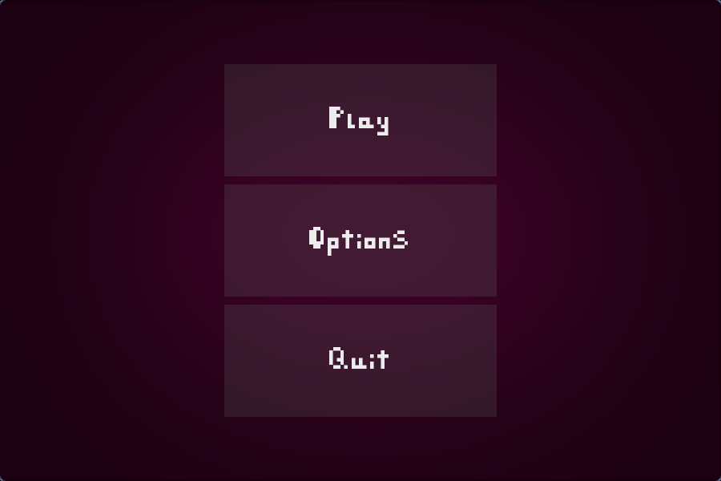
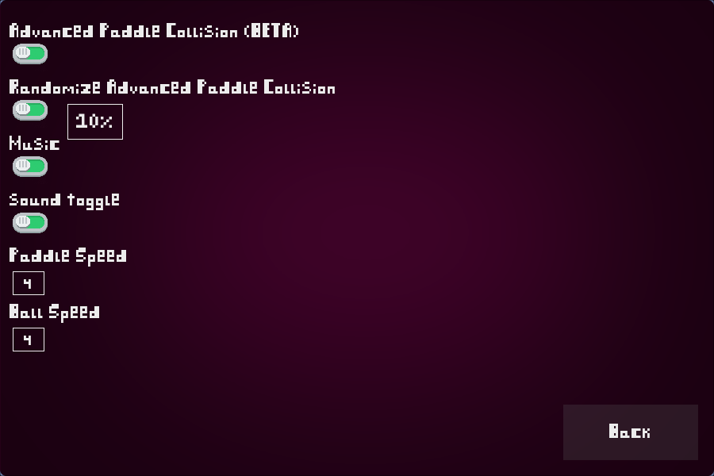
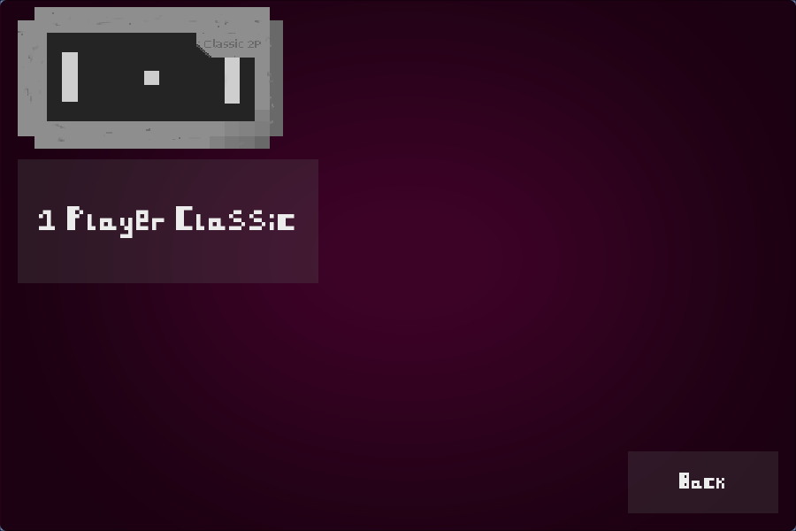
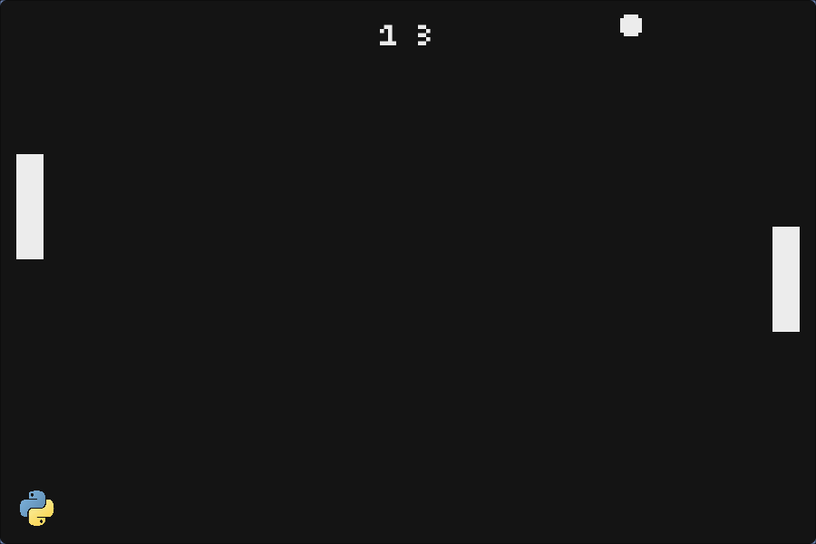

### About
This was my first Python project that I made. I learned the basics beforehand following [py4e](https://www.py4e.com/). The main project code is inside of `PyPongALPHA.py`. I also wrapped this project in a Nix flake for future reproduceability, though suprsingly, the latest versions of software suprisingly still work for this project, as of this creation.

### Download and Installation
```sh
git clone https://github.com/Shringe/PyPong.git
cd PyPong
```

## With Nix Package Manager
Using the [Nix](https://github.com/NixOS/nix) is the recommended method, as it is fully reproduceable.
```sh
nix develop
```

## Without Nix Package Manager
Make sure to install python3 beforehand.
```sh
python3 -m venv venv
source ./venv/bin/activate
pip install pygame
```

### Running
```sh
python3 "PyPongALPHA.py"
```

### Screenshots




