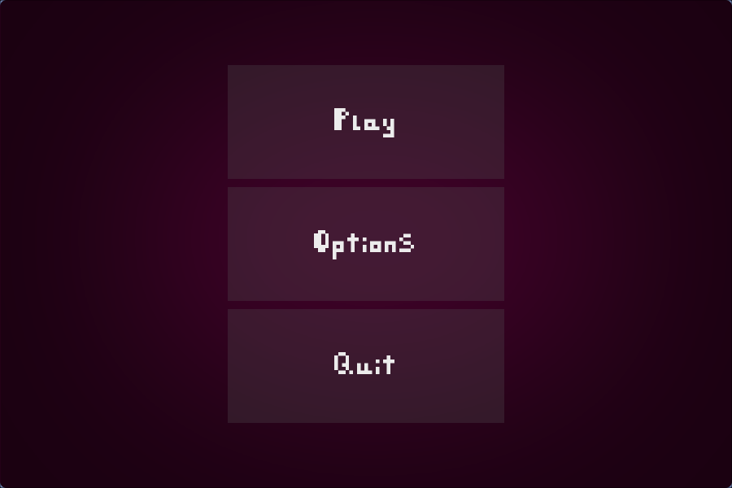
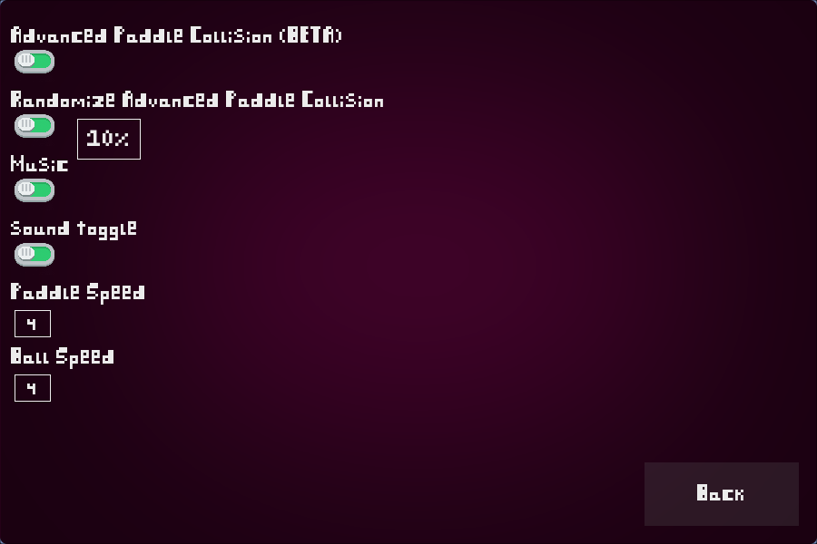
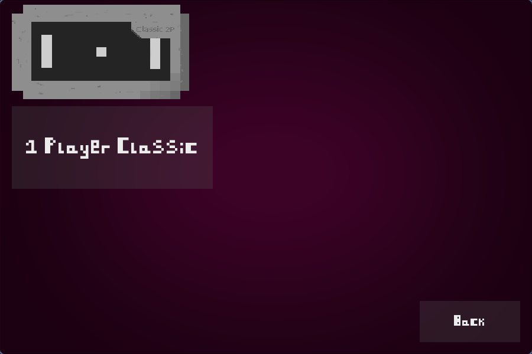
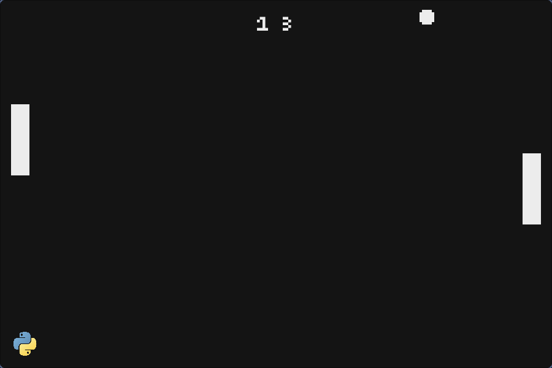

# About
This was my first Python project that I made. I learned the basics beforehand following [py4e](https://www.py4e.com/). The main project code is inside of `PyPongALPHA.py`. I also wrapped this project in a Nix flake for future reproduceability, though suprsingly, the latest versions of python and pygame still work for this project, even years after the project's creation.

# Features
PyPong has scoring, animations, assets, audio, easter eggs, UI, a settings menu, and a configurable physics system.

# Download and Installation
```sh
git clone https://github.com/Shringe/PyPong.git
cd PyPong
```

## Running
Make sure to be in the CWD while running the program so that it can find necessary assets.

### Running with Nix
Using the [Nix package manager](https://github.com/NixOS/nix) is the recommended method, since it is fully reproduceable.
```sh
nix run
```

### Running with a virtual environment
Make sure to install python3 beforehand.
```sh
python3 -m venv venv
source ./venv/bin/activate
pip install pygame
python3 "PyPongALPHA.py"
```

# Screenshots




